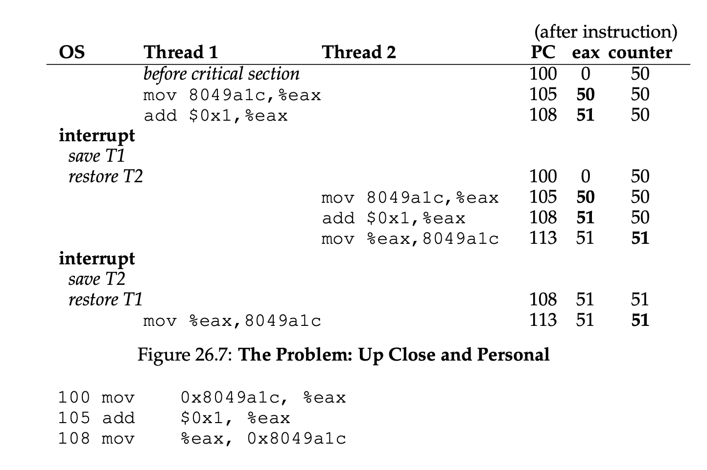
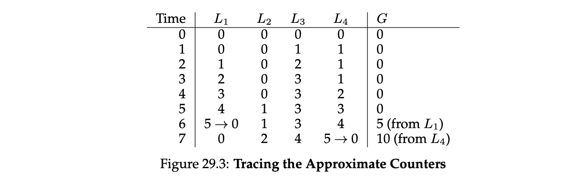
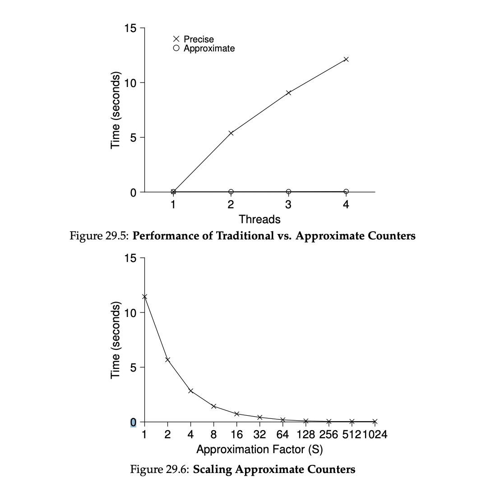

[TOC]

## Concurrency & Thread

**thread**: like process, but share the same address space with other threads, can access the same data 

a **multi-threaded** program has more than one point of execution (i.e., multiple PCs, each of which is being fetched and executed from)

**context-switch**: switching from running one thread (T1) to running the other (T2), register state of T1 must be saved to **thread control blocks (TCBs)** and the register state of T2 restored before running T2.

 In a multi-threaded process, each thread runs independently, and has **one stack per thread**: **thread-local storage**

Reasons for multi-thread: **parallel** with multiple processor, **avoid I/O block**

Example: 
a program that creates two threads, each of which run the function `mythread()`, in this case printing “A” or “B”

```c++
#include <stdio.h>
#include <assert.h>
#include <pthread.h>
#include "common.h"
#include "common_threads.h"

void *mythread(void *arg) {
	printf("%s\n", (char *) arg);
	return NULL;
}

int main(int argc, char *argv[]) {
  pthread_t p1, p2;
  int rc;
  printf("main: begin\n");
  Pthread_create(&p1, NULL, mythread, "A");
  Pthread_create(&p2, NULL, mythread, "B");
  // join waits for the threads to finish
  Pthread_join(p1, NULL);
  Pthread_join(p2, NULL);
  printf("main: end\n");
  return 0;
}
```

Possible execution order: T1 and T2 could run in different order, depends on scheduler


### race condition

Assume the following code where two threads wish to update a global shared variable, adding it to 20,000:
```c++
#include <stdio.h>
#include <stdlib.h>
#include <pthread.h>

#include "common.h"
#include "common_threads.h"

int max;
volatile int counter = 0; // shared global variable

void *mythread(void *arg) {
    char *letter = arg;
    int i; // stack (private per thread) 
    printf("%s: begin [addr of i: %p]\n", letter, &i);
    for (i = 0; i < max; i++) {
	counter = counter + 1; // shared: only one
    }
    printf("%s: done\n", letter);
    return NULL;
}
                                                                             
int main(int argc, char *argv[]) {                    
    if (argc != 2) {
	fprintf(stderr, "usage: main-first <loopcount>\n");
	exit(1);
    }
    max = atoi(argv[1]);

    pthread_t p1, p2;
    printf("main: begin [counter = %d] [%x]\n", counter, 
	   (unsigned int) &counter);
    Pthread_create(&p1, NULL, mythread, "A"); 
    Pthread_create(&p2, NULL, mythread, "B");
    // join waits for the threads to finish
    Pthread_join(p1, NULL); 
    Pthread_join(p2, NULL); 
    printf("main: done\n [counter: %d]\n [should: %d]\n", 
	   counter, max*2);
    return 0;
}
```
This code may yield different and random results on each run.

Explain: 
The adding `counter` assembly is like this in x86:

```assembly
mov 0x8049a1c, %eax
add $0x1, %eax
mov %eax, 0x8049a1c
```

The thread that is running could be interrupted, and the other thread starts running, and change `counter` inconsistently:

In this case, the `counter` is supposed to be 52, but is now 51. When T1 is interrupted, the register `eax=51` and saved by TCB, and when T2 is running, T2's `eax=51` is moved to `counter`. When T1 resumes, T1's `eax=51` is moved to `counter`, so `counter` is now still 51. This is called a **race condition**.

A **critical section** is a piece of code that accesses a shared variable (or more generally, a shared resource) and must not be concurrently executed by more than one thread.

**mutual exclusion** guarantees that if one thread is executing within the critical section, the others will be prevented from doing so.

## Locks

https://pages.cs.wisc.edu/~remzi/OSTEP/threads-locks.pdf

to execute a series of instructions atomically, in spite of interrupts on a single processor

A **lock variable** (or just “lock” for short) holds the state of the lock at any instant in time. It is either **available** (or **unlocked** or **free**) and thus no thread holds the lock, or **acquired** (or **locked** or **held**), and thus exactly one thread holds the lock and presumably is in a critical section.

```c++
lock_t mutex; // declare some globally-allocated lock ’mutex’
...
lock(&mutex); // the current thread acquire the lock
// critical section
balance = balance + 1;
// critical section over
unlock(&mutex); // free the lock
```

If another thread calls `lock()` on that same lock variable (`mutex`), it will not return while the lock is held by another thread; in this way, other threads are prevented from entering the critical section while the first thread that holds the lock is in there.

**Pthread locks**
POSIX threads code: **mutex** for lock in POSIX

```c++
pthread_mutex_t lock = PTHREAD_MUTEX_INITIALIZER;
Pthread_mutex_lock(&lock); // wrapper; exits on failure
balance = balance + 1;
Pthread_mutex_unlock(&lock);
```

A lock should be: mutual exclusion, fairness (no starve), performance
Some OS provides the following hardware support: 

### Simple Test-and-Set Spin lock

The lock:
```c++
typedef struct __lock_t {
	int flag;
} lock_t;

void init(lock_t *lock) {
// 0: lock is available, 1: lock is held
	lock->flag = 0;
}

void lock(lock_t *lock) {
	while (TestAndSet(&lock->flag, 1) == 1)
    ; // spin-wait (do nothing)
}

void unlock(lock_t *lock) {
	lock->flag = 0;
}
```

In which the `TestAndSet` method returns the old flag value and simultaneously updates the flag **atomically**

Test-and-set is mutual exclusive, but not fair and bad performance for single core

```c++
int TestAndSet(int *old_ptr, int new) {
	int old = *old_ptr; // fetch old value at old_ptr
	old_ptr = new; // store ’new’ into old_ptr
	return old; // return the old value
}
```

### Compare and Swap

```C++
void lock(lock_t *lock) {
	while (CompareAndSwap(&lock->flag, 0, 1) == 1)
		; // spin
}
```

`CompareAndSwap` checks if the flag is 0 and if so, atomically swaps in a 1 thus acquiring the lock

### Load-linked & Store-conditional

```c++
int LoadLinked(int *ptr) {
 return *ptr;
}

int StoreConditional(int *ptr, int value) {
  if (no update to *ptr since LoadLinked to this address) {
    *ptr = value;
 		return 1; // success!
  } else {
 		return 0; // failed to update
 	}
}
```

Use these to build a lock:

```c++
void lock(lock_t *lock) {
  while (1) {
    while (LoadLinked(&lock->flag) == 1)
      ; // spin until it’s zero
    if (StoreConditional(&lock->flag, 1) == 1)
      return; // if set-it-to-1 was a success: all done
    // otherwise: try it all over again
  }
}

void unlock(lock_t *lock) {
  lock->flag = 0;
}
```

### Fetch and Add

atomically increments a value while returning the old value at a particular address:
```c++
int FetchAndAdd(int *ptr) {
  int old = *ptr;
  *ptr = old + 1;
  return old;
}
```

### Not to spin

1. Thread runs and  **yields** CPU if another thread is holding the lock

   Problem: still inefficient if there are many threads contesting; Starvation problem

2. Using **queue**

   ```c++
   typedef struct __lock_t {
     int flag;
     int guard;
     queue_t *q;
   } lock_t;
   
   void lock_init(lock_t *m) {
     m->flag = 0;
     m->guard = 0;
     queue_init(m->q);
   }
   
   void lock(lock_t *m) {
     while (TestAndSet(&m->guard, 1) == 1)
       ; //acquire guard lock by spinning
     if (m->flag == 0) {
       m->flag = 1; // lock is acquired
       m->guard = 0;
     } else {
       queue_add(m->q, gettid());
       m->guard = 0;
       park();
     }
   }
   
   void unlock(lock_t *m) {
     while (TestAndSet(&m->guard, 1) == 1)
       ; //acquire guard lock by spinning
     if (queue_empty(m->q))
       m->flag = 0; // let go of lock; no one wants it
     else
       unpark(queue_remove(m->q)); // hold lock
     // (for next thread!)
     m->guard = 0;
   }
   
   ```

   `park()` to put a calling thread to sleep, and `unpark(threadID)` to wake a particular thread as designated by threadID
   `guard` is a spin-lock that protects `flag` and queue

## Concurrent Data Structures

https://pages.cs.wisc.edu/~remzi/OSTEP/threads-locks-usage.pdf

### counter

Works, but bad performance: not scalable
```c++
typedef struct __counter_t {
    int value;
    pthread_mutex_t lock;
} counter_t;

void init(counter_t *c) {
    c->value = 0;
    Pthread_mutex_init(&c->lock, NULL);
}

void increment(counter_t *c) {
    Pthread_mutex_lock(&c->lock);
    c->value++;
    Pthread_mutex_unlock(&c->lock);
}

void decrement(counter_t *c) {
    Pthread_mutex_lock(&c->lock);
    c->value--;
    Pthread_mutex_unlock(&c->lock);
}

int get(counter_t *c) {
    Pthread_mutex_lock(&c->lock);
    int rc = c->value;
    Pthread_mutex_unlock(&c->lock);
    return rc;
}
```

### scalable counter

**approximate counter**

Four local counters (one for each cpu core), and a global counter. One lock for each local counter, and one lock for global counter;

When a thread running on a given core wishes to increment the counter, it increments its local counter; No contention between threads;

the local values are periodically (**Theshold S**) transferred to the global counter, by acquiring the global lock and incrementing it by the local counter’s value; the local counter is then reset to zero;

The smaller S is, the more the counter behaves like the non-scalable counter above; the bigger S is, the more scalable the counter, but the further off the global value might be from the actual count.



```c++
typedef struct __counter_t {
    int global; // global count
    pthread_mutex_t glock; // global lock
    int local[NUMCPUS]; // per-CPU count
    pthread_mutex_t llock[NUMCPUS]; // ... and locks
    int threshold; // update frequency
} counter_t;

// init: record threshold, init locks, init values
// of all local counts and global count
void init(counter_t *c, int threshold) {
    c->threshold = threshold;
    c->global = 0;
    pthread_mutex_init(&c->glock, NULL);
    int i;
    for (i = 0; i < NUMCPUS; i++) {
        c->local[i] = 0;
        pthread_mutex_init(&c->llock[i], NULL);
    }
}

// update: usually, just grab local lock and update
// local amount; once local count has risen ’threshold’,
// grab global lock and transfer local values to it
void update(counter_t *c, int threadID, int amt) {
    int cpu = threadID % NUMCPUS;
    pthread_mutex_lock(&c->llock[cpu]);
    c->local[cpu] += amt;
    if (c->local[cpu] >= c->threshold) {
        // transfer to global (assumes amt>0)
        pthread_mutex_lock(&c->glock);
        c->global += c->local[cpu];
        pthread_mutex_unlock(&c->glock);
        c->local[cpu] = 0;
    }
    pthread_mutex_unlock(&c->llock[cpu]);
}

// get: just return global amount (approximate)
int get(counter_t *c) {
    pthread_mutex_lock(&c->glock);
    int val = c->global;
    pthread_mutex_unlock(&c->glock);
    return val; // only approximate!
}
```

Approximate counters are more efficient than traditional counters:


### concurrent linked list

Without scaling:
```c++
typedef struct __node_t {
    int key;
    struct __node_t *next;
} node_t;

typedef struct __list_t {
    node_t *head;
    pthread_mutex_t lock;
} list_t;

void List_Init(list_t *L) {
    L->head = NULL;
    pthread_mutex_init(&L->lock, NULL);
}

int List_Insert(list_t *L, int key) {
    pthread_mutex_lock(&L->lock);
    node_t *new = malloc(sizeof(node_t));
    if (new == NULL) {
        perror("malloc");
        pthread_mutex_unlock(&L->lock);
        return -1; // fail
    }
    new->key = key;
    new->next = L->head;
    L->head = new;
    pthread_mutex_unlock(&L->lock);
    return 0; // success
}

int List_Lookup(list_t *L, int key) {
    pthread_mutex_lock(&L->lock);
    node_t *curr = L->head;
    while (curr) {
        if (curr->key == key) {
            pthread_mutex_unlock(&L->lock);
            return 0; // success
        }
        curr = curr->next;
    }
    pthread_mutex_unlock(&L->lock);
    return -1; // failure
}
```

Scaling: **hand-over-hand locking (lock coupling)**
add a lock per node of the list, When traversing the list, the code first grabs the next node’s lock and then releases the current node’s lock

### concurrent queue

### concurrent hash table

## Conditional variable

 A condition variable is an explicit **queue** that threads can put themselves on when some state of execution (i.e., some **condition**) is not as desired (by **waiting** on the condition), some other thread, when it changes said state, can then wake one (or more) of those waiting threads and thus allow them to continue (by **signaling** on the condition). 

Declare a conditional variable: `pthread_cond_t c`, 
methods: `wait()` and `signal()`

example: parent wait for child
```c++
int done = 0;
pthread_mutex_t m = PTHREAD_MUTEX_INITIALIZER;
pthread_cond_t c = PTHREAD_COND_INITIALIZER; // conditional variable

void thr_exit() {
    Pthread_mutex_lock(&m);
    done = 1;
    Pthread_cond_signal(&c); // signal
    Pthread_mutex_unlock(&m);
}

void *child(void *arg) {
    printf("child\n");
    thr_exit();
    return NULL;
}

void thr_join() {
    Pthread_mutex_lock(&m);
    while (done == 0)
        Pthread_cond_wait(&c, &m); // wait
    Pthread_mutex_unlock(&m);
}

int main(int argc, char *argv[]) {
    printf("parent: begin\n");
    pthread_t p;
    Pthread_create(&p, NULL, child, NULL);
    thr_join();
    printf("parent: end\n");
    return 0;
}
```

Wait & signal: 
```c++
pthread_cond_wait(pthread_cond_t *c, pthread_mutex_t *m); // also takes a lock as param
pthread_cond_signal(pthread_cond_t *c);
```

`wait()` takes a lock as parameter: to release the lock and put the calling thread to sleep (atomically); when the thread wakes up (after some other thread has signaled it), it must re-acquire the lock before returning to the caller. 

## Semaphore

a single primitive for all things related to synchronization: both **locks** and **condition variables**

**semaphore**: an object with a integer value, `sem_wait()`, `sem_post()`

```c++
int sem_wait(sem_t *s) {
    decrement the value of semaphore s by one
    wait if value of semaphore s is negative
}

int sem_post(sem_t *s) {
    increment the value of semaphore s by one
    if there are one or more threads waiting, wake one
}
```

Binary semaphpore - lock
