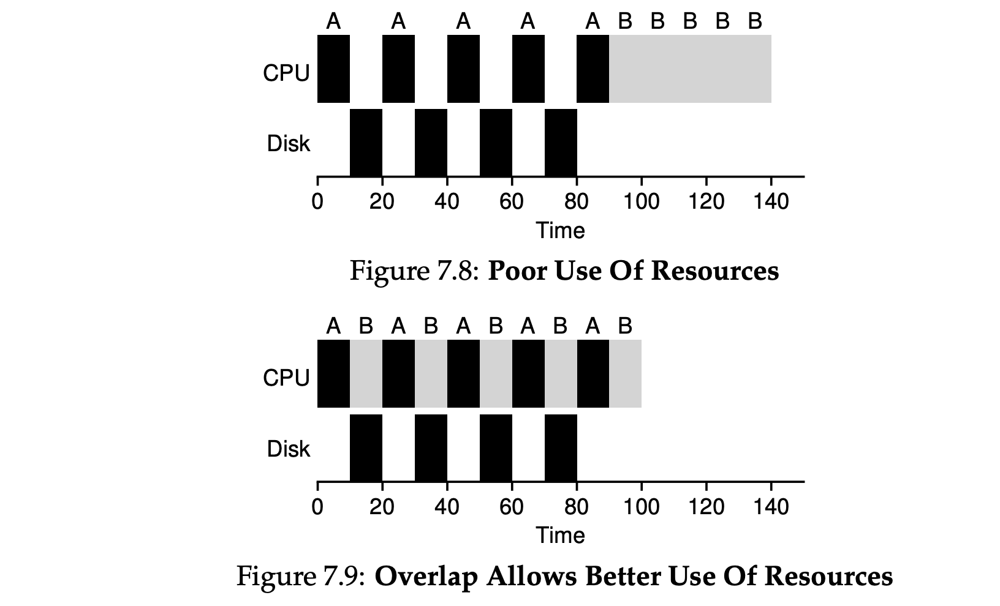
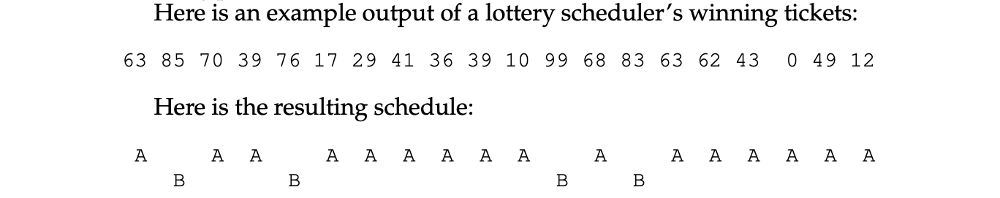
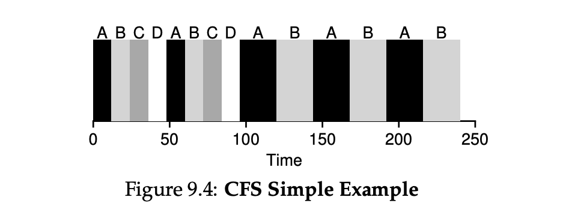

# CPU Scheduling

[TOC]

assume that: 

1. Each job runs for the same amount of time. 
2. All jobs arrive at the same time. 
3. Once started, each job runs to completion. 
4. All jobs only use the CPU (i.e., they perform no I/O) 
5. The run-time of each job is known.

scheduling metric for comparing: **turnaround time**

the time at which the job completes minus the time at which the job arrived in the system. 
$$
T_{turnaround} = T_{completion} - T_{arrival}
$$

> assuming All jobs arrive at the same time, $T_{turnaround}=T_{completion}$


## Scheduling Algorithms

### First in, First out (FIFO)


**convoy effect**: relatively-short potential consumers of a resource get queued behind a heavyweight resource consumer


### Shortest Job First (SJF)

suppose all tasks arrive at same time


T = (10+20+120)/3 = 50

but if they don't arrive at the same time


T = 103.33

### Shortest Time-to-Completion First (STCF)

it can **preempt** job A and decide to run another job, perhaps continuing A later.


T = 50


... but considering **response time**: when the job arrives in a system to the first time it is scheduled
$$
T_{response} = T_{firstrun} - T_{arrival}
$$

### Round Robin (time-slicing)

instead of running jobs to completion, RR runs a job for a time slice (sometimes called a scheduling quantum) and then switches to the next job in the run queue. It repeatedly does so until the jobs are finished.


> RR: $T_{response}=1$
>
> SJF: $T_{response}=5$

the **length of the time slice** is critical for RR. The shorter it is, the better the performance of RR under the response-time metric. However, making the time slice too short is problematic: suddenly the **cost of context switching** will dominate overall performance. 

deciding on the length of the time slice: making it long enough to **amortize** the cost of switching without making it so long that the system is no longer responsive.


Turnaround time: RR even worse than FIFO

any policy (such as RR) that is **fair**, i.e., that evenly divides the CPU among active processes on a small time scale, will perform poorly on metrics such as turnaround time

**Trade-off**: : **unfair** for shorter turnaround time, at the cost of response time; **fair** for shorter response time, at the cost of turnaround time


### with I/O

when I/O starts -> CPU idle -> schedule new job?

when I/O finish -> CPU interrupt -> return to old job?



> A: 50ms job with a 10ms I/O every 10ms
>
> B: 50ms job with no I/O
>
> When the first sub-job of A has completed, only B is left, and it begins running. Then a new sub-job of A is submitted, and it preempts B and runs for 10 ms. Doing so allows for **overlap**, with the CPU being used by one process while waiting for the I/O of another process to complete; the system is thus better utilized 


[todo] homework: scheduler.py


## Multi-level Feedback Queue (MLFQ)

the MLFQ has a number of distinct **queues**, each assigned a different **priority level**. At any given time, a job that is ready to run is on a single queue. MLFQ uses priorities to decide which job should run at a given time: a job with higher priority (i.e., a job on a higher queue) is chosen to run. Of course, more than one job may be on a given queue, and thus have the same priority. In this case, we will just use round-robin scheduling among those jobs. 

- **Rule 1**: If Priority(A) > Priority(B), A runs (B doesn’t).
- **Rule 2**: If Priority(A) = Priority(B), A & B run in RR.


MLFQ varies the priority of a job based on its *observed behavior*:

interactive jobs that are short-running (and may frequently relinquish the CPU) - **high priority**

longer-running “CPU-bound” jobs that need a lot of CPU time but where response time isn’t important. - **low priority**

### How to change Priority

- **Rule 3**: When a job enters the system, it is placed at the highest priority (the topmost queue).
- **Rule 4a**: If a job uses up an entire time slice while running, its priority is reduced (i.e., it moves down one queue). 
- **Rule 4b**: If a job gives up the CPU before the time slice is up, it stays at the same priority level.

**Example**: long running job


> the job enters at the highest priority (Q2). After a single time-slice of 10 ms, the scheduler reduces the job’s priority by one, and thus the job is on Q1. After running at Q1 for a time slice, the job is finally lowered to the lowest priority in the system (Q0)

**Example**: along came a short job


> A (shown in black) is running along in the lowest-priority queue (as would any long-running CPUintensive jobs); B (shown in gray) arrives at time T = 100, and thus is inserted into the highest queue; as its run-time is short (only 20 ms), B completes before reaching the bottom queue, in two time slices; then A resumes running (at low priority).

**Example**: with I/O


> interactive job B (shown in gray) that needs the CPU only for 1 ms before performing an I/O.  The MLFQ approach keeps B at the highest priority because B keeps releasing the CPU

But these rules have problems:

1. starvation: if there are “too many” interactive jobs in the system, s long-running jobs will never receive any CPU time (they starve).
2. Job trick the scheduler with frequent I/O, gaming
3. a program may change its behavior over time

### Priority Boost

 avoid starvation: periodically **boost** the priority of all the jobs in system.

- **Rule 5**: After some time period S, move all the jobs in the system to the topmost queue.

Example


> On the left, there is no priority boost, and thus the long-running job gets starved once the two short jobs arrive; on the right, there is a priority boost every 50 ms (which is likely too small of a value, but used here for the example), and thus we at least guarantee that the long-running job will make some progress, getting boosted to the highest priority every 50 ms and thus getting to run periodically

### Better Accounting

Gaming tolerance:

- **Rule 4**: Once a job uses up its time allotment at a given level (regardless of how many times it has given up the CPU), its priority is reduced (i.e., it moves down one queue).


### MLFQ: Summary

- Rule 1: If Priority(A) > Priority(B), A runs (B doesn’t). 

- Rule 2: If Priority(A) = Priority(B), A & B run in round-robin fashion using the time slice (quantum length) of the given queue. 

- Rule 3: When a job enters the system, it is placed at the highest priority (the topmost queue). 

- Rule 4: Once a job uses up its time allotment at a given level (regardless of how many times it has given up the CPU), its priority is reduced (i.e., it moves down one queue). - gaming

- Rule 5: After some time period S, move all the jobs in the system to the topmost queue. - starvation

[homework] mlfq.py


## Lottery Scheduling

**proportional-share** scheduler, also sometimes referred to as a fair-share scheduler. Instead of optimizing for turnaround or response time, a scheduler might instead try to guarantee that each job obtain a certain percentage of CPU time.

### tickets

The percent of **tickets** that a process has represents its share of the system resource in question. E.g. A has 75 tickets while B has only 25. Thus, what we would like is for A to receive 75% of the CPU and B the remaining 25%.

the scheduler must know how many total tickets there are (in our example, there are 100). The scheduler then picks a winning ticket, which is a number from 0 to 991 . Assuming A holds tickets 0 through 74 and B 75 through 99, the winning ticket simply determines whether A or B runs. The scheduler then loads the state of that winning process and runs it.



**ticket currency**： allows a user with a set of tickets to allocate tickets among their own jobs in whatever currency they would like

**ticket transfer**: a process can temporarily hand off its tickets to another process, especially useful in a client/server setting

**ticket inflation**: a process can temporarily raise or lower the number of tickets it owns.

### Implementation

To make a scheduling decision, we first have to pick a random number (the winner) from the total number of tickets (400). Let’s say we pick the number 300. Then, we simply traverse the list, with a simple counter used to help us find the winner (Figure 9.1). The code walks the list of processes, adding each ticket value to counter until the value exceeds winner. Once that is the case, the current list element is the winner. 


```cpp
 // counter: used to track if we’ve found the winner yet
 int counter = 0;

 // winner: use some call to a random number generator to
 // get a value, between 0 and the total # of tickets
 int winner = getrandom(0, totaltickets);

 // current: use this to walk through the list of jobs
 node_t *current = head;
 while (current) {
 	counter = counter + current->tickets;
 	if (counter > winner)
 		break; // found the winner
 	current = current->next;
 }
 // ’current’ is the winner: schedule it...
```

### Stride scheduling

Each job in the system has a stride, which is inverse in proportion to the number of tickets it has.

E.g. jobs A, B, and C, with 100, 50, and 250 tickets, respectively, we can compute the stride of each by dividing some large number by the number of tickets each process has been assigned. For example, if we divide 10,000 by each of those ticket values, we obtain the following stride values for A, B, and C: 100, 200, and 40, the **stride** of each process. every time a process runs, we will increment a counter for it (called its **pass** value) by its stride to track its global progress.

The scheduler then uses the stride and pass to determine which process should run next. The basic idea is simple: at any given time, **pick the process to run that has the lowest pass value** so far;


lottery scheduling: **no global state**

### The Linux Completely Fair Scheduler (CFS)

**virtual runtime `vruntime`**
As each process runs, it accumulates `vruntime`. In the most basic case, each process’s vruntime increases at the same rate, in proportion with physical (real) time. When a scheduling decision occurs, CFS will pick the process with the lowest `vruntime` to run next.

**when to stop running and start next process?**
`sched_latency`: determine dynamic time slice, how long one process should run before considering a switch

`min_granularity`: minimum length of dynamic time slice (`sched_latency/n`), in case process number (n) is too big



> assume n=4 process running
> sched_latency = 48ms
> time_slice = 48/n = 12ms
> when 2 processes are fininshed, n=2
> time_slice change to 24ms

**weighting (niceness)**

set a **nice level** for a process: from -20 to +19, default 0
higher nice level means lower priority

map nice level to `weight`:
```
static const int prio_to_weight[40] = {
/* -20 */ 88761, 71755, 56483, 46273, 36291,
/* -15 */ 29154, 23254, 18705, 14949, 11916,
/* -10 */ 9548, 7620, 6100, 4904, 3906,
/* -5 */ 3121, 2501, 1991, 1586, 1277,
/* 0 */ 1024, 820, 655, 526, 423,
/* 5 */ 335, 272, 215, 172, 137,
/* 10 */ 110, 87, 70, 56, 45,
/* 15 */ 36, 29, 23, 18, 15,
};
```

computing time slice
$$
time\_slice_k = \frac{weight_k}{\sum_{i=0}^{n-1}weight_i}*sched\_latency
$$

> e.g.
> A: nice value -5, B: nice value 0
> then weight_a = 3121, weight_b = 1024,
> A’s time slice is about 3/4 of sched latency (hence, 36 ms), and B’s about 1/4 (hence, 12 ms).

compute vruntime: scales actual run time inversely by the weight of the process
$$
vruntime_i = vruntimei+\frac{weight_0}{weight_i}*runtime_i
$$
One smart aspect of the construction of the table of weights above is that the table **preserves CPU proportionality ratios** when the difference in nice values is constant. For example, if process A instead had a nice value of 5 (not -5), and process B had a nice value of 10 (not 0), CFS would schedule them in exactly the same manner as before. 

**Red black tree**

store running processes in a red black tree by vruntime, to ensure O(log n) insertion and deletion

