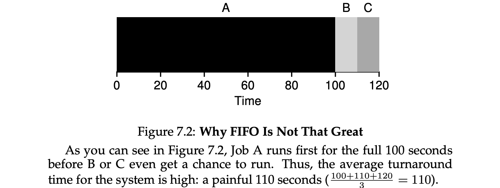
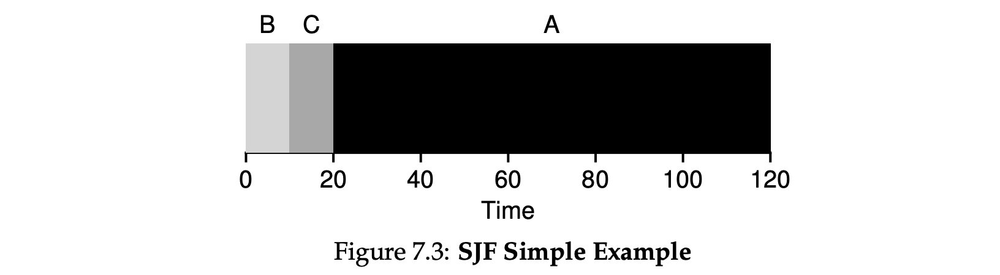
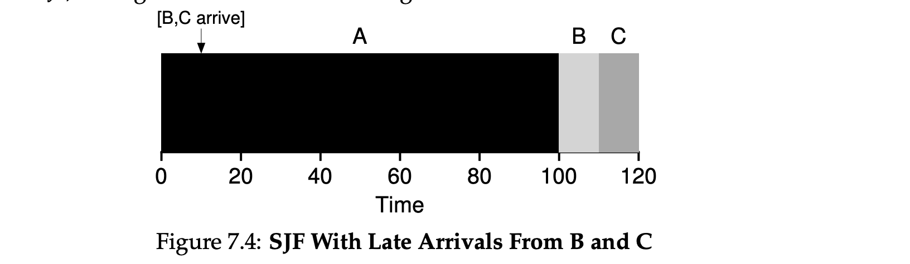
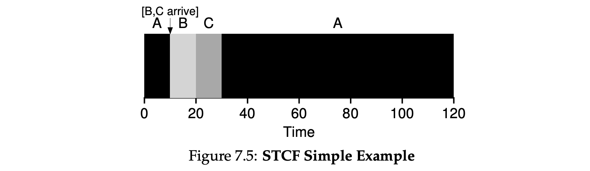
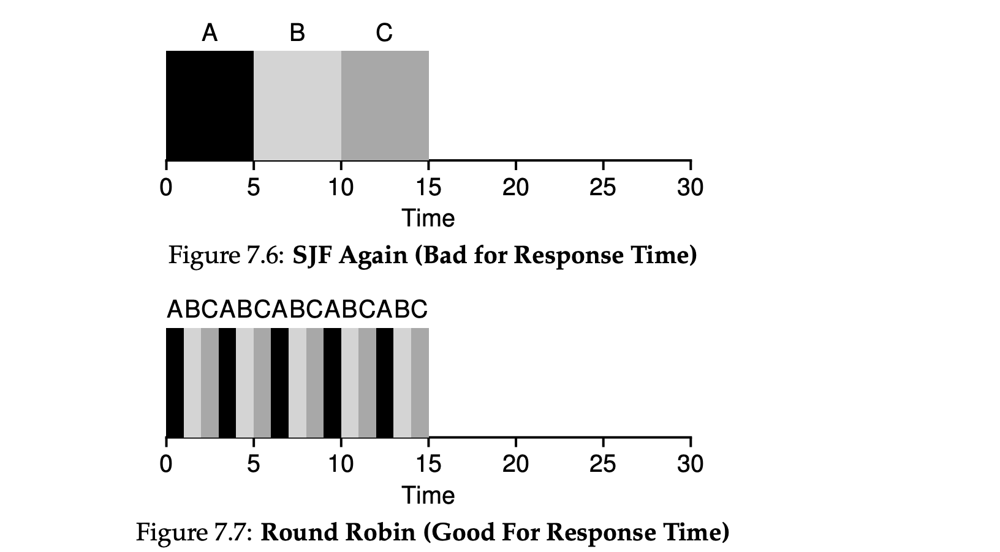

# CPU Scheduling

assume that: 

1. Each job runs for the same amount of time. 
2. All jobs arrive at the same time. 
3. Once started, each job runs to completion. 
4. All jobs only use the CPU (i.e., they perform no I/O) 
5. The run-time of each job is known.

scheduling metric for comparing: **turnaround time**

the time at which the job completes minus the time at which the job arrived in the system. 
$$
T_{turnaround} = T_{completion} - T_{arrival}
$$

> assuming All jobs arrive at the same time, $T_{turnaround}=T_{completion}$

### Scheduling Algorithms

#### First in, First out (FIFO)

**convoy effect**: relatively-short potential consumers of a resource get queued behind a heavyweight resource consumer

#### Shortest Job First (SJF)

suppose all tasks arrive at same time

T = (10+20+120)/3 = 50

but if they don't arrive at the same time

T = 103.33

#### Shortest Time-to-Completion First (STCF)

it can **preempt** job A and decide to run another job, perhaps continuing A later.

T = 50

... but considering **response time**: when the job arrives in a system to the first time it is scheduled
$$
T_{response} = T_{firstrun} - T_{arrival}
$$

#### Round Robin (time-slicing)

instead of running jobs to completion, RR runs a job for a time slice (sometimes called a scheduling quantum) and then switches to the next job in the run queue. It repeatedly does so until the jobs are finished.

> RR: $T_{response}=1$
>
> SJF: $T_{response}=5$

the **length of the time slice** is critical for RR. The shorter it is, the better the performance of RR under the response-time metric. However, making the time slice too short is problematic: suddenly the **cost of context switching** will dominate overall performance. 

deciding on the length of the time slice: making it long enough to **amortize** the cost of switching without making it so long that the system is no longer responsive.

Turnaround time: RR even worse than FIFO

any policy (such as RR) that is **fair**, i.e., that evenly divides the CPU among active processes on a small time scale, will perform poorly on metrics such as turnaround time

**Trade-off**: : **unfair** for shorter turnaround time, at the cost of response time; **fair** for shorter response time, at the cost of turnaround time

#### I/O

