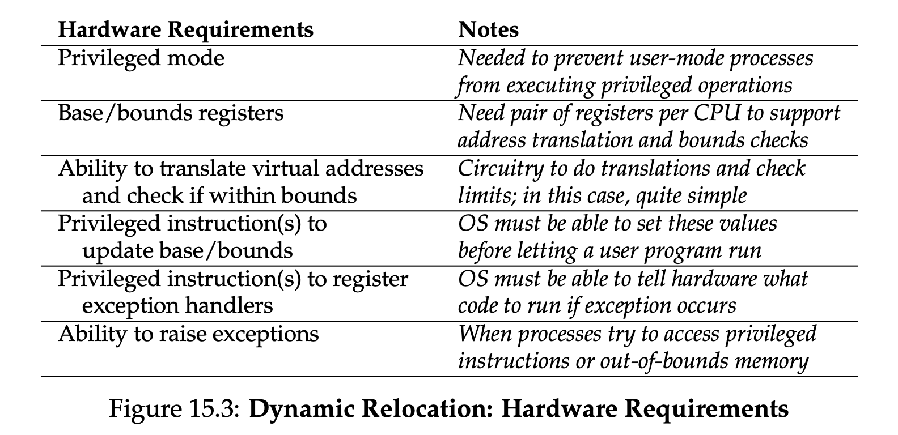
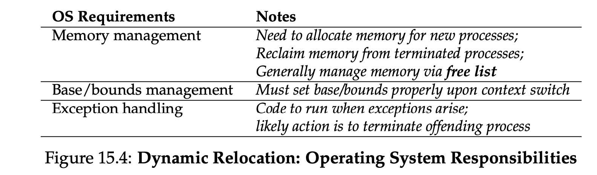
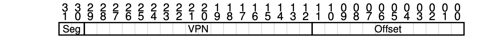
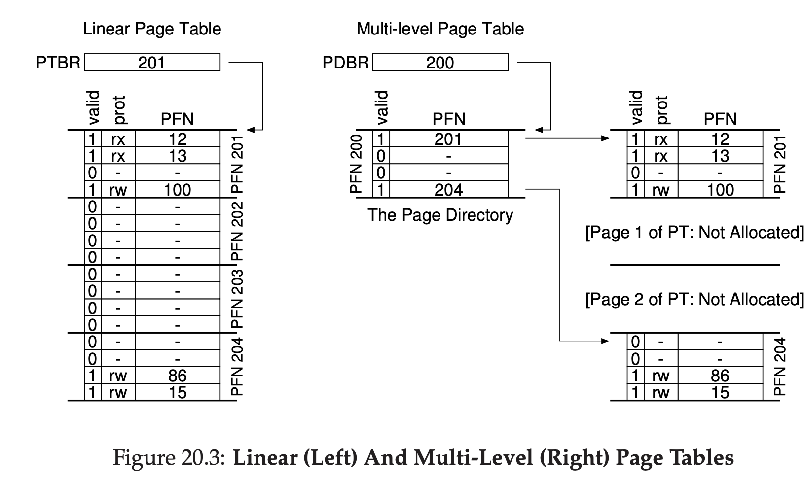
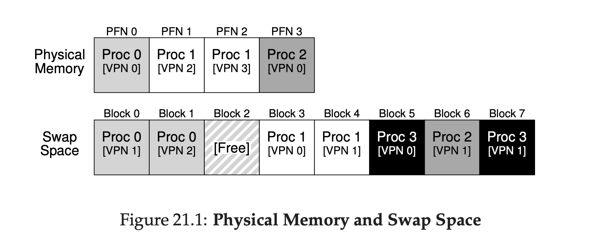

[TOC]

## Address Space

when multiple processes are running at the same time (time-sharing): 


requires the OS to create an easy to use **abstraction** of physical memory. We call this abstraction the **address space**, and it is the running program’s view of memory in the system. 

a process: code, heap & stack:


**stack** to keep track of where it is in the function call chain, allocate local variables, pass parameters and return values to and from routines.
**heap** is used for dynamically-allocated, user-managed memory, such as that you might receive from a call to malloc() in C or new in an objectoriented language such as C++ or Java. 

The program really isn’t in memory at physical addresses 0 through 16KB; rather it is loaded at some arbitrary physical address(es). 

Goal of Virtual Memory (VM):
- invisible to process
- time & space efficient
- memory protection 

## memory API

**stack memory**： function scope, short-lived, automatic manage by compiler

```c++
void func() {
int x; // declares an integer on the stack
...
}
```


**heap memory**: long-lived, allocations and deallocations are explicitly handled the programmer
allocate heap mem in C: `malloc(size_t size)`

```c++
void func() {
int *x = (int *) malloc(sizeof(int));
...
}
```

free memory: `free()`

```c++
int *x = malloc(10 * sizeof(int));
...
free(x);
```


## Address Translation

 the hardware transforms each memory access (e.g., an instruction fetch, load, or store), changing the **virtual address** provided by the instruction to a **physical address** where the desired information is actually located. 

e.g. consider this function:
```c
void func() {
int x = 3000; // thanks, Perry.
x = x + 3; // line of code we are interested in
```

```assembly
128: movl 0x0(%ebx), %eax ;load 0+ebx into eax
132: addl $0x03, %eax ;add 3 to eax register
135: movl %eax, 0x0(%ebx) ;store eax back to mem
```

process address space：


in physical memory:


> Address translation: make the program feels that it has its own memory starting from addr 0

### Dynamic (Hardware-based) Relocation

**base and bounds: memory management unit**

Base and bound registers hardcoded on chips

physical address = virtual address + **base** (32KB for e.g. in Fig 15.2)

If a process generates a virtual address that is greater than the **bounds** (16KB for e.g. in Fig 15.2), or one that is negative, the CPU will raise an exception

e.g.
```assembly
128: movl 0x0(%ebx), %eax 
```
The program counter (PC) is set to 128; when the hardware needs to fetch this instruction, it first adds the value to the base register value of 32 KB (32768) to get a physical address of 32896;

**hardware needs to**


**OS needs to**


## Segmentation

> To solve: How to support large address space ?

**segmentation**: to place each segment (e.g. code, heap, stack) independently in physical memory

Suppose a virtual address space:


Place it into physical memory in segments:


We would have these segment registers in MMU:


> e.g. find physical address for virtual address 4200 (in heap) in Fig 16.1
>
> First find which byte in *this segment* the address refers to: 4200 - 4096 = 104 (**offset**);
> Add to heap base: 104 + 34K = 34920;
> 104 is less than size (3K);
> So we get physical address 43920

Visiting illegal address: **segmentation fault**

#### which segment?

**explicit**: use address digits to divide segments


**implicit**： hardware determines segment by noticing how the address is formed

### Stack: grows backwards

Segment registers need to support negative growth


e.g.
Virtual addr 15KB: 11 1100 0000 0000 (hex 0x3C00)
Seg: 11, offset: 3KB
Negative offset: 3K - 4K = -1KB
Physical address: 28K - 1K = 27KB

## Free space management

Segmentation/user allocate memory -> external fragmentation: the free space gets chopped into little pieces of different sizes and is thus fragmented

### Splitting and Coalescing

Assume a heap from `malloc()` , heap will have a **free list** to manage free space
```c
void *malloc(size t size)
void free(void *ptr)
```

A 30-byte heap:


Free list:


If request for a space > 10 bytes: fail
If request for a space < 10 bytes: 
**splitting**: it will find a free chunk of memory that can satisfy the request and split it into two. The first chunk it will return to the caller; the second chunk will remain on the list.

e.g. request for 1 byte and free list turn into:


**Coalescing**: When a chunk of memory is freed, merge nearby free chunks

### Tracking The Size Of Allocated Regions

The **header** minimally contains the size of the allocated region (in this case, 20); it may also contain additional pointers to speed up deallocation, a magic number to provide additional integrity checking, and other information.

`malloc(20)` returns `ptr`
when a user requests N bytes of memory, the library does not search for a free chunk of size N; rather, it searches for a free chunk of size N plus the size of the header.

### Embedding A Free List

build the free list inside the free space itself

Assume we have a 4096-byte chunk of memory (4KB), construct the first node of free list:

`head`: pointer to head of free list
`size`: free space is 4096 - 8(free list node) = 4088 bytes
`next`: address of next free chunk, 0  because there is only one free chunk

Now we request 100 bytes


Library allocated 108 bytes (8 for header, 100 for request), return `ptr` to allocated space
`head` updated
`size`: 4088 - 108 = 3980

when there are three allocated regions, each of 100 bytes (or 108 including the header):


The first 324 bytes of the heap are now allocated (108*3), 
Size of free space: 4096 - 324 - 8 = 3764

Now if we call `free()` on `sptr`(16500 in  physical addr):


`sptr` is now free, header removed, and node of free list added, `next` point to next node

### basic strategies of free space allocation

**best-fit**: first, search through the free list and find chunks of free memory that are as big or bigger than the requested size. Then, return the one that is the smallest in that group of candidates;
**worst-fit**:  find the largest chunk and return the requested amount; keep the remaining (large) chunk on the free list.
**first-fit**: finds the first block that is big enough and returns the requested amount to the user.
**next-fit**: Instead of always beginning the first-fit search at the beginning of the list, the next fit algorithm keeps an extra pointer to the location within the list where one was looking last. 

## Paging

we divide virtual memory into fixed-sized units, each of which we call a **page**. Correspondingly, we view physical memory as an array of fixed-sized slots called **page frames**;

pages in virtual address space:


page frame in physical memory:


**page table**: store **address translations** for each of the virtual pages of the address space, thus letting us know where in physical memory each page resides.

page table is a **per-process** data structure (an exception is the inverted page table). If another process were to run in our example above, the OS would have to manage a different page table.

The page table for above example: 

```
(Virtual Page 0 → Physical Frame 3),
(VP 1 → PF 7), (VP 2 → PF 5), and (VP 3 → PF 2)
```

Address translation example:

Suppose we have a virtual address space of 64 bytes, we want to perform an access:
```
movl <virtual address>, %eax
```

First split virtual address into two components: the **virtual page number (VPN)**, and the **offset** within the page. Virtual address is 6 digits (2^6=64), so:


Suppose virtual address is 21 (010101), and in page table VP1->PF7, translate VA to PA:


structure of page table: a mapping of VPN to **page frame number (PFN)**


**valid bit**: indicate whether the particular translation is valid, avoid illegal access.
**protection bit**: indicating whether the page could be read from, written to, or executed from.
**present bit**: whether this page is in physical memory or on disk.
**dirty bit**: whether the page has been modified since it was brought into memory.
**reference bit** (a.k.a. accessed bit):  sometimes used to track whether a page has been accessed, and is useful in determining which pages are popular and thus should be kept in memory

For every memory reference (whether an instruction fetch or an explicit load or store), paging requires us to perform **one extra memory reference** in order to first fetch the page translation entry (PTE) from the page table. Costy!


> To solve problem: accessing page table every time is costly

### Translation-lookaside buffer (TLB): faster page translation

A hardware cache of address translations on chip's memory-management unit (MMU).
The first time a page is accessed, its address translation is cached, so next time it will be a TLB hit, reading address mapping from cache directly

>  To solve problem: page tables are too big and thus consume too much memory

### Hybrid Method: Segmentation + Paging

Have a page table for EACH logical segment (code, heap, stack)
The base of the segment points to the physical address of the page table. The bounds register is used to indicate the end of the page table.

Assume a 32-bit virtual address space with 4KB pages, and an address space split into four segments.
We use three segments (code, heap, stack), so we will have **three base/bound pairs**



We can get the address of the page table entry (PTE):
```
SN = (VirtualAddress & SEG_MASK) >> SN_SHIFT
VPN = (VirtualAddress & VPN_MASK) >> VPN_SHIFT
AddressOfPTE = Base[SN] + (VPN * sizeof(PTE))
```

### Multi-Level Page Table

A linear page table into a tree: divide page table itself into pages, use a **page directory** as the "page table" of page tables.

If an entire page of page-table entries (PTEs) is invalid, don’t allocate that page of the page table at all. 



 Page directory consists of a number of **page directory entries (PDE)**. A PDE (minimally) has a **valid bit** and a **page frame number (PFN)**.

If the PDE is valid, it means that at least one of the pages of the page table that the entry points to (via the PFN)

**Cost: time-space trade-off**
on a TLB miss, two loads from memory will be required to get the right translation information from the page table (one for the page directory, and one for the PTE itself)

## Swapping Space

Swapping some pages from memory to hard disk

**Swap space**: Reserved space on the disk for moving pages back and forth



> three processes (Proc 0, Proc 1, and Proc 2) are actively sharing physical memory; each of the three, however, only have some of their valid pages in memory, with the rest located in swap space on disk. 
