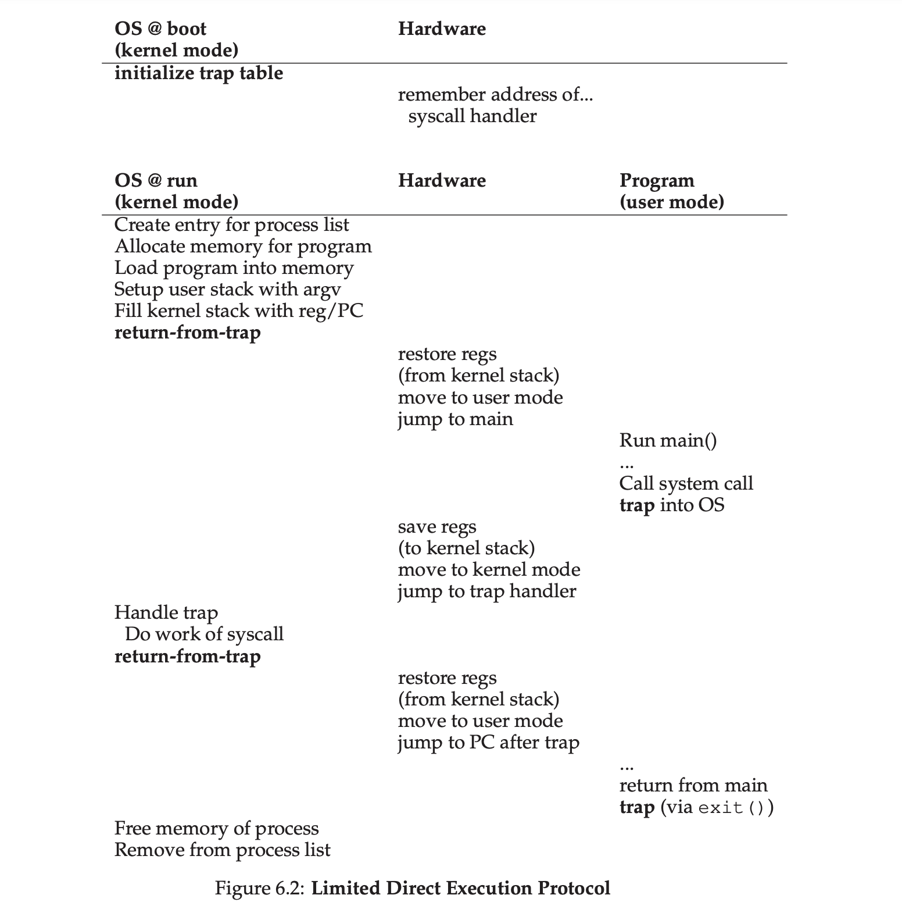
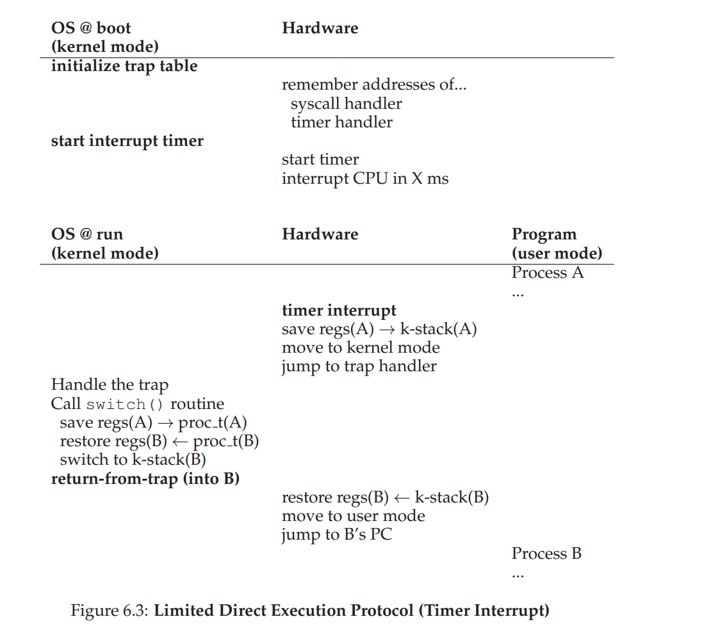

# process

**process**: a **running** program

Virtualize CPU: time sharing

**machine state**: what a program can read or update when it is running

memory, register

**process API**: create, destroy, wait, misc control, status

**process creation**:

1. load code & static data: eagerly vs lazily
2. allocate memory for program's run-time stack & heap
3. I/O initialization

**process states**

- **Running**: In the running state, a process is running on a processor. This means it is executing instructions. 

- **Ready**: In the ready state, a process is ready to run but for some reason the OS has chosen not to run it at this given moment.
- **Blocked**: In the blocked state, a process has performed some kind of operation that makes it not ready to run until some other event takes place. A common example: when a process initiates an I/O request to a disk, it becomes blocked and thus some other process can use the processor

> HOMEWORK: https://github.com/remzi-arpacidusseau/ostep-homework/tree/master/cpu-intro
>
> run [process-run.py](https://github.com/remzi-arpacidusseau/ostep-homework/blob/master/cpu-intro/process-run.py) to understand how cpu arrange process (cpu, I/O) order, and how does it impact cpu and io usage rate

## process API

Unix process API

`fork()`

`wait()`

 the separation of fork() and exec() is essential in building a **UNIX shell**, because it lets the shell run code after the call to fork() but before the call to exec(); this code can alter the environment of the about-to-be-run program, and thus enables a variety of interesting features to be readily built.

**ASIDE: KEY PROCESS API TERMS** 

- Each process has a name; in most systems, that name is a number known as a process ID (PID). 

- The fork() system call is used in UNIX systems to create a new process. The creator is called the parent; the newly created process is called the child. As sometimes occurs in real life [J16], the child process is a nearly identical copy of the parent. 

- The wait() system call allows a parent to wait for its child to complete execution. 

- The exec() family of system calls allows a child to break free from its similarity to its parent and execute an entirely new program. 

- A UNIX shell commonly uses fork(), wait(), and exec() to launch user commands; the separation of fork and exec enables features like input/output redirection, pipes, and other cool features, all without changing anything about the programs being run. 

- Process control is available in the form of signals, which can cause jobs to stop, continue, or even terminate. 

- Which processes can be controlled by a particular person is encapsulated in the notion of a user; the operating system allows multiple users onto the system, and ensures users can only control their own processes. - A superuser can control all processes (and indeed do many other things); this role should be assumed infrequently and with caution for security reasons.

## Limited Direct Execution

Two questions when virtualizing hardware:

1. how to restrict operations, like I/O?
2. how to stop a process and switch to another process, i.e. time sharing?

### restrict operations - user mode & kernel mode

In **user mode**, applications do not have full access to hardware resources. 

In **kernel mode**, the OS has access to the full resources of the machine.

**trap, return-from-trap**: program execute **trap** instruction to enter kernel mode, and calls **return-from-trap** to go back to user-mode

the processor will push the program counter, flags, and a few other registers onto a per-process kernel stack; the return-fromtrap will pop these values off the stack and resume execution of the usermode program.

**trap table**: initialized on system boot, tells hardware what code to run (the location of **trap-handlers**) on exceptional events

### switching between process - time sharing

How can the operating system **regain control** of the CPU so that it can switch between processes?

#### cooperative approach

 OS trusts the processes of the system to behave reasonably. 

Most processes, as it turns out, transfer control of the CPU to the OS quite frequently by making **system calls** (e.g. open file, create new process), or make explicit **yield** system call, which does nothing except to transfer control to the OS 

#### non-cooperative approach

**timer interrupt**

when the interrupt is raised, the currently running process is halted, and a pre-configured **interrupt handler** in the OS runs. At this point, the OS has regained control of the CPU

### save & restore context

**scheduler **decides whether to continue running the currently-running process, or switch to a different one

if switch process -> **context switch**

> In this example, Process A is running and then is interrupted by the timer interrupt. The hardware saves its registers (onto its kernel stack) and enters the kernel (switching to kernel mode). In the timer interrupt handler, the OS decides to switch from running Process A to Process B. At that point, it calls the switch() routine, which carefully saves current register values (into the process structure of A), restores the registers of Process B (from its process structure entry), and then switches contexts, specifically by changing the stack pointer to use B’s kernel stack (and not A’s). Finally, the OS returnsfrom-trap, which restores B’s registers and starts running it.

 During interrupt or trap handling, another interrupt occurs: **Concurrency**

