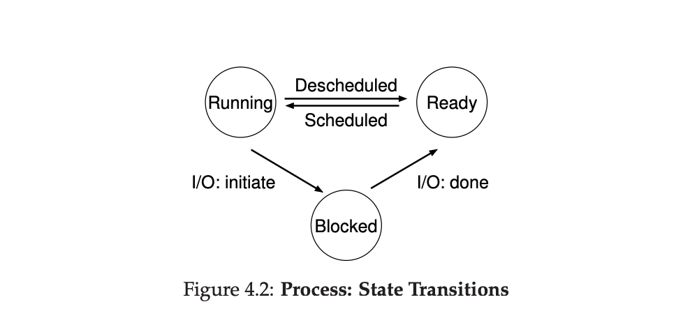

# process

**process**: a **running** program

Virtualize CPU: time sharing

**machine state**: what a program can read or update when it is running

memory, register

**process API**: create, destroy, wait, misc control, status

**process creation**:

1. load code & static data: eagerly vs lazily
2. allocate memory for program's run-time stack & heap
3. I/O initialization

**process states**

- **Running**: In the running state, a process is running on a processor. This means it is executing instructions. 

- **Ready**: In the ready state, a process is ready to run but for some reason the OS has chosen not to run it at this given moment.
- **Blocked**: In the blocked state, a process has performed some kind of operation that makes it not ready to run until some other event takes place. A common example: when a process initiates an I/O request to a disk, it becomes blocked and thus some other process can use the processor

> HOMEWORK: https://github.com/remzi-arpacidusseau/ostep-homework/tree/master/cpu-intro
>
> run [process-run.py](https://github.com/remzi-arpacidusseau/ostep-homework/blob/master/cpu-intro/process-run.py) to understand how cpu arrange process (cpu, I/O) order, and how does it impact cpu and io usage rate